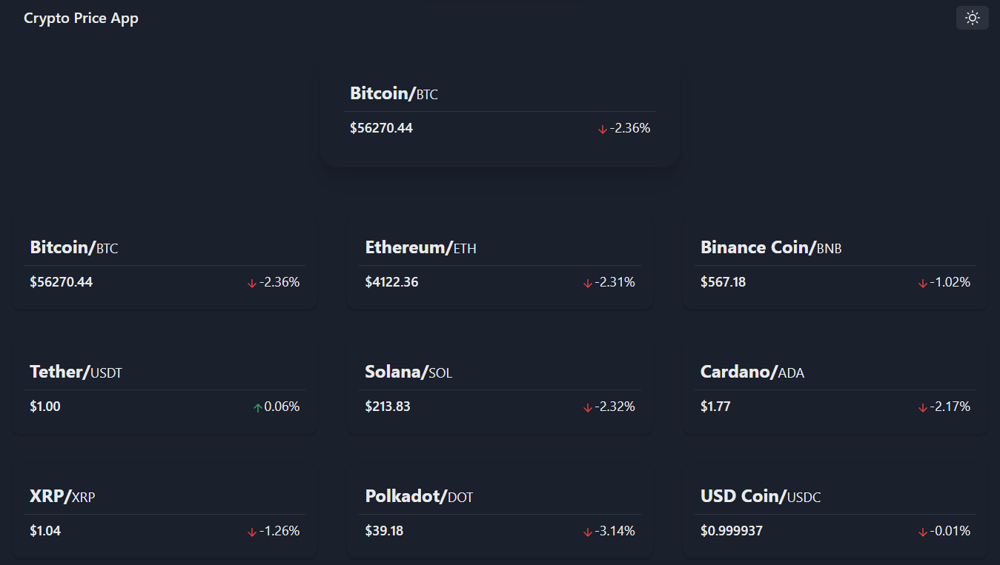
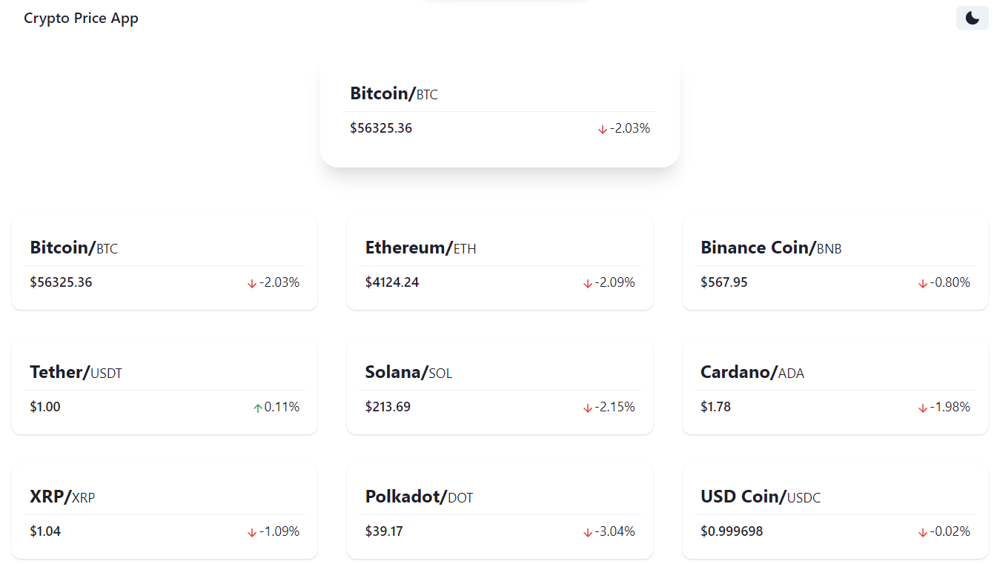

## Crypto Price App NEXT.JS
<br>
<br>


<br>
<br>
<br>

<br>
Build using NEXT.JS & CHAKRA UI

<br>
Its a practice project for learning next js

<br>

### Using Coinlore api for fetching coins prices. ###

<br>
<br>
First, run the development server:

```bash
npm run dev
# or
yarn dev
```

Open [http://localhost:3000](http://localhost:3000) with your browser to see the result.


